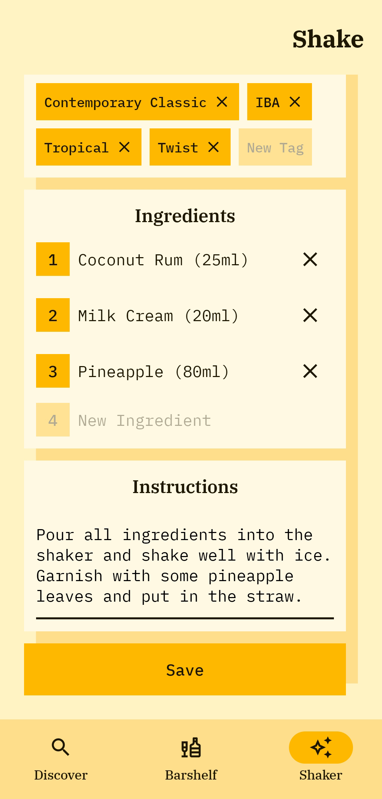

<div>
  
  <h1 style="margin-top: 0">Shake</h1>
</div>

Shake is a sample Android application for discovering and tracking cocktail recipes.
Based on [**thecocktaildb.com**](https://www.thecocktaildb.com), Shake allows to search cocktails
by name and filters, bookmark favorite recipes and create custom cocktails via a simple built-in editor.


## Screenshots

<div style="width: 800px">
  <div align="center">
    
    
    
  </div>
  <div>
    
    
    
    
  </div>
</div>


## Technologies & Approaches

- [**Kotlin**](https://developer.android.com/kotlin)
  as programming language
  - [**kotlinx.DateTime**](https://github.com/Kotlin/kotlinx-datetime) 
    for date & time manipulations
- [**Coroutines**](https://kotlinlang.org/docs/coroutines-overview.html)
  as asynchronous and multithreading operations framework
- [**Dagger Hilt**](https://developer.android.com/training/dependency-injection/hilt-android)
  for dependency injection
  - [**Hilt Compose**](https://developer.android.com/jetpack/compose/libraries#hilt)
    for accessing ViewModels from composables
- [**Jetpack Compose**](https://developer.android.com/jetpack/compose)
  for building user interface layouts
  - [**Material Design 3**](https://m3.material.io)
    as user interface design toolkit
  - [**Accompanist**](https://google.github.io/accompanist/flowlayout)
    for accessing additional composables
  - [**Custom Modifier**](https://developer.android.com/jetpack/compose/modifiers)
    for building complex user interface elements
  - [**Tooling**](https://developer.android.com/jetpack/compose/tooling)
    for building previews
- [**androidx.Lifecycle**](https://developer.android.com/topic/libraries/architecture/lifecycle)
  for implementing **Model-View-ViewModel** pattern
- [**Navigation Component Compose**](https://developer.android.com/jetpack/compose/navigation)
  for composable navigation
- [**Coil Compose**](https://coil-kt.github.io/coil/compose)
  for loading images inside of composable
- [**Retrofit 2**](https://square.github.io/retrofit)
  for network communication with API
  - [**Moshi**](https://github.com/square/moshi)
      for JSON parsing
- [**Realm**](https://realm.io/realm-kotlin)
  for deploying & managing local database
- [**MediaStore**](https://developer.android.com/training/data-storage/shared/media)
  for storing & retrieving images
- [**Gradle Kotlin DSL**](https://developer.android.com/studio/build/migrate-to-kts) 
  for managing build configurations


## Unique Features

**i.e. what is unique among other samples?**

- **Jetpack Compose** for building user interface 
  [**screens**](https://github.com/rskopyl/Shake/tree/main/app/src/main/java/com/rskopyl/shake/ui/screen)
  - **Custom Modifier** for displaying 
    [**mirroring and shimmer**](https://github.com/rskopyl/Shake/blob/main/app/src/main/java/com/rskopyl/shake/ui/custom/Modifier.kt)
    effects
  - **Custom Composition Locals** for accessing 
    [**custom theming resources**](https://github.com/rskopyl/Shake/tree/main/app/src/main/java/com/rskopyl/shake/ui/theme)
- **Moshi** for parsing JSON responses into 
  [**cocktail DTOs**](https://github.com/rskopyl/Shake/tree/main/app/src/main/java/com/rskopyl/shake/data/remote/dto)
- **Realm** for deploying & managing 
  [**cocktail database**](https://github.com/rskopyl/Shake/blob/main/app/src/main/java/com/rskopyl/shake/di/DatabaseModule.kt)
- **MediaStore** for storing and retrieving
  [**cocktail images within gallery**](https://github.com/rskopyl/Shake/blob/main/app/src/main/java/com/rskopyl/shake/util/Extensions.kt)


##  License

```
MIT License

Copyright (c) 2023 Rostyslav Kopyl

Permission is hereby granted, free of charge, to any person obtaining a copy
of this software and associated documentation files (the "Software"), to deal
in the Software without restriction, including without limitation the rights
to use, copy, modify, merge, publish, distribute, sublicense, and/or sell
copies of the Software, and to permit persons to whom the Software is
furnished to do so, subject to the following conditions:

The above copyright notice and this permission notice shall be included in all
copies or substantial portions of the Software.

THE SOFTWARE IS PROVIDED "AS IS", WITHOUT WARRANTY OF ANY KIND, EXPRESS OR
IMPLIED, INCLUDING BUT NOT LIMITED TO THE WARRANTIES OF MERCHANTABILITY,
FITNESS FOR A PARTICULAR PURPOSE AND NONINFRINGEMENT. IN NO EVENT SHALL THE
AUTHORS OR COPYRIGHT HOLDERS BE LIABLE FOR ANY CLAIM, DAMAGES OR OTHER
LIABILITY, WHETHER IN AN ACTION OF CONTRACT, TORT OR OTHERWISE, ARISING FROM,
OUT OF OR IN CONNECTION WITH THE SOFTWARE OR THE USE OR OTHER DEALINGS IN THE
SOFTWARE.
```